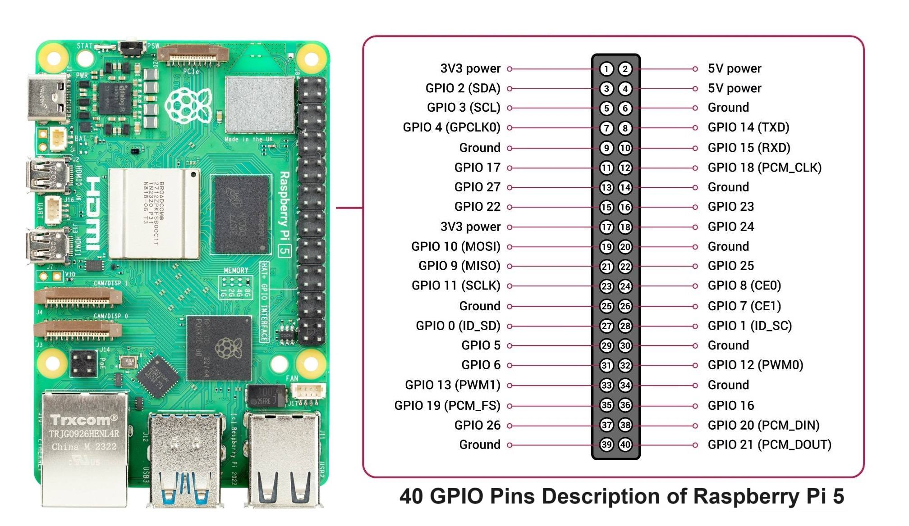
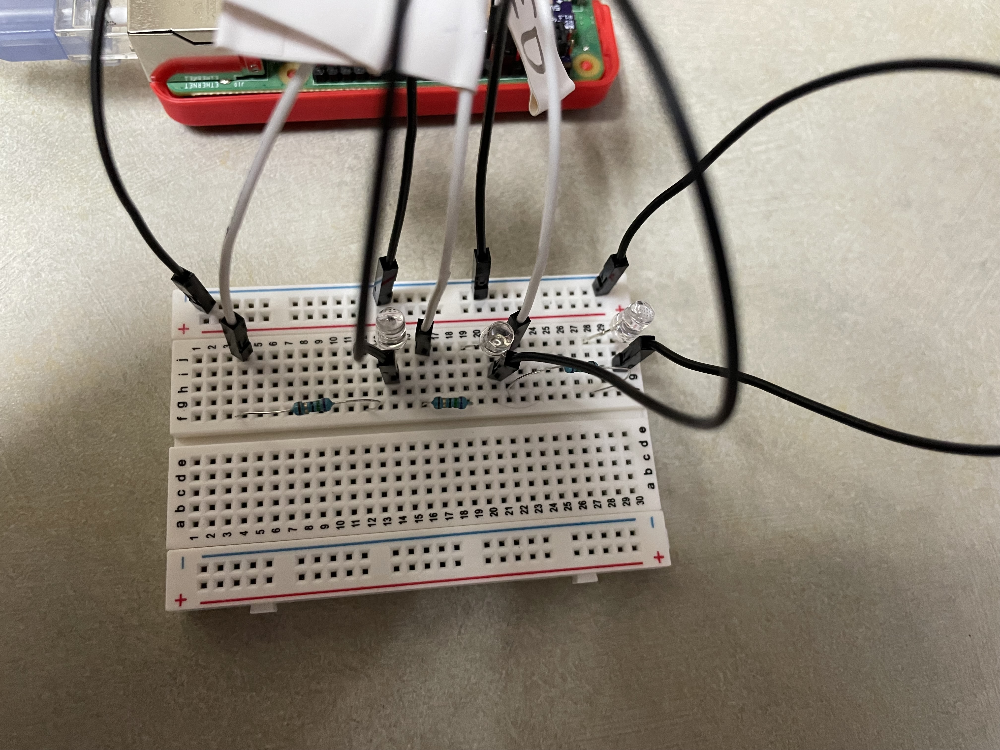
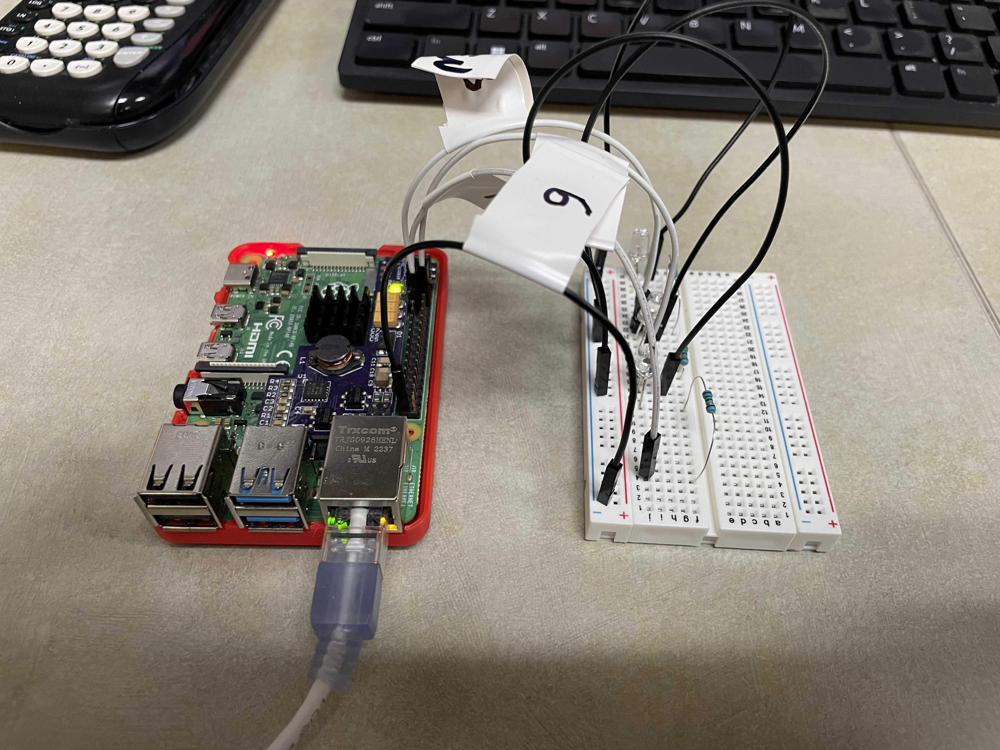

# Stoplight Control Web App

This project is a **Flask web application** that controls a set of **LEDs on a breadboard** to simulate a traffic stoplight. It provides a simple interface to control the stoplight (red, yellow, green LEDs) through a web page. The LEDs are connected to a Raspberry Pi 5, and you can control the stoplight via the buttons on the homepage.

---

## Hardware Requirements

- **Raspberry Pi 5 or 4**
- **3 LEDs** (Red, Yellow, Green)
- **3 75 Ω Resistors**
- **1 Breadboard**
- **3 Male to Male Jumper Wires**
- **4 Male to Female Jumper Wires**
- **GPIO Pins 17(Pin11),18(Pin12), and 27(Pin13)** on the Raspberry Pi
- **Connect to any Ground pin of the PI**

## GPIO Diagram


---

## Wiring Diagram


---

## Software Requirements

- Python 3.11 or greater
- Flask
- gpiozero
- time
- threading
- render_template
- jsonify
- Install the necessary Python libraries by running:

```bash
apt install python-gpiozero
apt install python-flask
```
---

## Running the Program
1. Clone the repo to a folder
2. In the same folder as the app.py folder, run the following command:

```bash
python app.py
```
---

## Full Stepup


